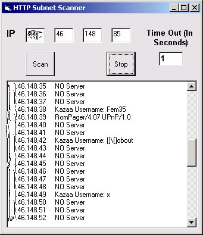



## Open HTTP Scanner

### Description

Someone requested that I did this, so here it is a HTTP Subnet scanner, basically it just scans whole subnets for open port 80, then when it finds an IP with port 80 open it finds out what server it’s running (eg apache/IIS etc) and what version, but if it’s Kazaa which is using port 80, it finds out that persons Kazaa username. Fully Documented, uses Inet controls (internet Transfer Control), and Winsock.
 
### More Info
 

             |
---                |---
**Submitted On**   |2003-02-03 08:22:02
**By**             |[Peter Rowan](https://github.com/Planet-Source-Code/PSCIndex/blob/master/ByAuthor/peter-rowan.md)
**Level**          |Beginner
**User Rating**    |4.8 (19 globes from 4 users)
**Compatibility**  |VB 6\.0
**Category**       |[Internet/ HTML](https://github.com/Planet-Source-Code/PSCIndex/blob/master/ByCategory/internet-html__1-34.md)
**World**          |[Visual Basic](https://github.com/Planet-Source-Code/PSCIndex/blob/master/ByWorld/visual-basic.md)
**Archive File**   |[Open\_HTTP\_153881232003\.zip](https://github.com/Planet-Source-Code/peter-rowan-open-http-scanner__1-42924/archive/master.zip)

